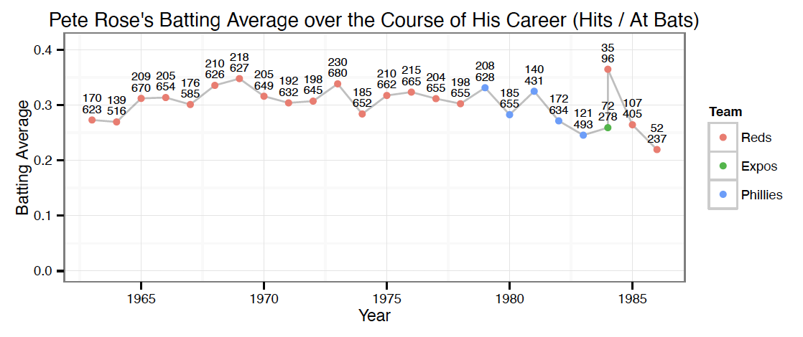

```{r setup, include=FALSE}
knitr::opts_chunk$set(echo = TRUE, fig.align = 'center')
```


## The Lahman Package

Sean Lahman is an author and journalist, who led the fight to make sports data open to the public. One of his most famous efforts was creating an open-source database of baseball data. A version of his database is in R through the __Lahman__ package. In this homework, we will practice our skills at making plots! Much of the "grunt" work will be done by me, but you will still have plenty to do and change!!

## Loading packages

```{r, message=FALSE}
# You may have to install these packages before the document will knit. I have
# included the installation lines below but commented out! Get rid of the
# hashtags before running. You only have to install the package once, but every
# time you knit the document you need to have the library statements because it
# opens up a fresh session of R behind the scenes.

# install.packages("tidyverse")
# install.packages("Lahman")

# loading the tidyverse and setting the theme to black-white (it's my favorite theme)
library("tidyverse");theme_set(theme_bw())
# loading the Lahman package
library("Lahman")
```

Now that we have everything installed and loaded into R, we can take a look at all of the datasets in the Lahman package... and there are a lot of them! Running the code `data(package = "Lahman")` will open a list of data sets in the Lahman package. There are 30 datasets in total! We will focus on the `Batting` dataset. Here it is below:

```{r}
# original data is a data frame but tibbles are nicer to work with
(batting <- as_tibble(Batting))

# let's look at the range of years we have! 
batting$yearID %>% range()
# from 1871 to 2018! That's a lot! 
```

Notes about the code above: 

- parentheses around an assignment statement will print the result
- the `$` operator will access the specific variable in the tibble
- The `%>%` is called the pipe operator and takes the result of the left side and puts it in the first argument of the function on the right.

That's a lot of data (147 years worth) in there! Let's hone in something interesting in baseball's past that would be cool to look at! In 1969, the MLB lowered the pitching mound by 10 inches and shrunk the strike zone to what it is today. This really benefited the batters and took a huge advantage away from pitchers. Thus, let's look at batting averages for those two seasons and see if there is a difference graphically. Specifically, let's make a side-by-side boxplot to carry out our comparison. The code below carries out this task (almost!). 

Description and comments of the code below:

- This code below is often called a data analysis pipeline because I can change the years or the minimum at-bats, and get a whole different analysis (here just a plot) without having to re-write any code.
- I also hope that you notice/think this code is pretty readable! Without any R knowledge, you could probably tell me what is happening. That is what the tidyverse is trying to do!
- Code steps explanation:
    + The first step filters the data to only include the years 1968 and 1969. The `|` represents or and to check equality is `==`. A single `=` is assigning a value to a variable.
    + The second step changes the `yearID` variable to be a factor (categorical variable) because R will yell at you if year is still a numeric value when plotting.
    + The third step filters the dataset so that only players with more than 50 at-bats are included. This was a personal choice that you can change if you want! It gets rid of some outliers due to players only batting a few times that year.
    + The fourth step creates a new variable, `avg` that holds the batting average, because it was not present in the original dataset.

__Problem 1__: The code below doesn't create the side-by-side boxplot of batting average for the two years mentioned above. You need to complete the code so that it produces the correct plot! I have included the ggplot call but you need to choose the right aesthetics and finish the `geom_` call. Make sure to remove the hashtags before the last `%>%` and the `ggplot` call or it won't make the graph.
```{r}
batting %>% 
    filter(yearID == 1968 | yearID == 1969) %>%
    mutate(yearID = as_factor(yearID)) %>% 
    filter(AB > 50) %>% 
    mutate(avg = H / AB) # %>% 
    # ggplot(aes()) + geom_()
```

__Problem 2__: Comment on the plot's findings.


Another interesting time in baseball was the steroid era, which I will define as the 1990's! During this time, an increased number of major league players used performance enhancing drugs. One way that we could explore the data to see if there were any side-effects is looking at home run production. Specifically, I want to make a plot of the total home run count for every year between 1980 and 2000 with dots and a path between them. This will give us some reference for before and during the time when steroids were present. For this plot, I also want to put the actual home run totals on the plot above the points.

__Problem 3__: Again, fill in the correct aesthetics that are missing and the correct geoms to make the points and the path between them. Again make sure to take away the hashtags to produce the plot.

```{r}
batting %>% 
    filter(yearID >= 1980 & yearID <= 2000) %>% 
    group_by(yearID) %>% 
    summarize(hr_total = sum(HR)) # %>% 
     # ggplot(aes( , , label = hr_total)) + geom_() + geom_() + geom_label(size = 3, vjust = -.25) + labs(x = "Year", y = "Home Run Total")
    
```

__Problem 4__: Comment on the plot. Does it seem to support increased doping in that time span? Do you think any external factors other than doping could have affected the increase?


One of the most famous players in the doping era was Barry Bonds. Barry Bonds played for the Pittsburgh Pirates early in his career and was very successful there, but it wasn't until he started playing for the San Francisco Giants that he started putting up huge home run numbers. If you look up "Barry Bonds Doping", you will find many  pictures of the difference in body mass between Pittsburgh and in San Francisco. Many people point to that as evidence toward doping. Let's look at his career trajectory through his home run production.

__Problem 5__: I have done the filtering for you, but I want you to create the entire ggplot by yourself! I have the ggplot call there but nothing else. Remember to chain ggplot2 statements together with `+`'s Do the following:

- Create a point plot of home runs over the years he was active.
- Color the points with the team he was playing for at the time. You'll need to add another aesthetic.
- Change the labels to be more descriptive.
- Change the legend so that the legend title says Team and the team name is what's describing the color (Pirates, Giants). You will accomplish this with the function `scale_color_discrete()`. Make sure to look it up for reference.

```{r}
batting %>% 
    filter(playerID == "bondsba01") #%>% 
    # ggplot() +  
    

```

__Problem 6__: Comment on the plot.


For this last plot, I want you to think of your favorite baseball player. If you don't have one or don't care about baseball, then search for the list of the greatest baseball hitters of all time and choose from one of those. We are going to plot their batting average over time and compare it to every other player in the `Batting` dataset! Specifically, we are going to do the following:

- Search for the `playerID` of your person.
- Create a separate dataset just for them and make the batting average variable.
- Create a dataset for everyone else that only contains batting averages for seasons with more than 50 at-bats. Also, we need to standardize the years so that they all fit on one plot.
- Plot the averages over the career years with a line in the background.
- Overlay your favorite players in red. 


To find your player, we need to look in the `Master` dataset that contains personal information about them. For instance, if I was looking for a player named Roberto Clemente, I would do the following:
```{r}
filter(Master, nameLast == "Clemente")
```
 
Next, make a dataset with just that player. Also, add two new variables. One is the batting average and two is the career years that the person played. For instance, if I were to make one for Roberto, it would look like this:
```{r}
clem_bat <- batting %>% 
    filter(playerID == "clemero01") %>% 
    mutate(avg = H / AB, career = yearID - min(yearID))
```

Now we are going to do the same thing for everyone else, and add in the more than 50 AB condition!

```{r}
other_bats <- batting %>% 
    filter(AB > 50) %>% 
    group_by(playerID) %>% 
    arrange(playerID, yearID, teamID) %>%
    mutate(avg = H / AB, career = yearID - min(yearID))
```

Lastly, we need to make the plot! Here are the steps you should follow to make the plot:

__Problem 7__:

- First call `ggplot()` using the `other_bats` data with aesthetics to show change in batting average over time.
- Add on a geom that tracks the path from one year to another. Don't use dots. In your call to the geom, make sure to add the statement `alpha = 0.02`. This is called alpha blending and it help you avoid overplotting!
- Make the x axis go from 0 to 20 by 5 and the y axis go from 0 to 0.4 by 0.1. This is accomplished by adding the two lines `scale_x_continuous("Career Year", breaks = seq(0, 20, 5), limits = c(0, 20))` and `scale_y_continuous("Batting Average", breaks = seq(0, 0.4, 0.1), limits = c(0, 0.4))`. This will also fix the labels.
- Lastly, make another line/path using just the data from your player's small dataset and color it red.

Put the code in the empty code chunk below.

```{r}

```

__Extra Credit__: If you are really interested in making these plots, I challenge you to try and recreate the plot below about Pete Rose.

